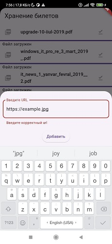

### Целевая платформа
Данная реализация фичи сохранения билетов разрабатывалась под Android.

---
### Реализовано
Реализован BottomSheet с валидацией url ссылки. Поддерживается автоматическая вставка, если в буфере обмена содержится валидная url. При успешном добавлении ссылки отображается snackbar.

Во время загрузки отображается индикатор загрузки, а также тестовая информация о размере загружаемого файла и проценте загрузки.

Благодаря инспользованию `hydrated_bloc` данные сохраняются при перезагрузке приложения.

---
### Backlog
- Разбиение приложения по слоям
- Удаление карточки билета по свайпу
- Пауза и возобновление загрузки 
- Открытие pdf в отдельном окне
- Чекбоксы для выбора нескольких билетов

---

### Ссылки на демонстрацию работы/скриншоты

